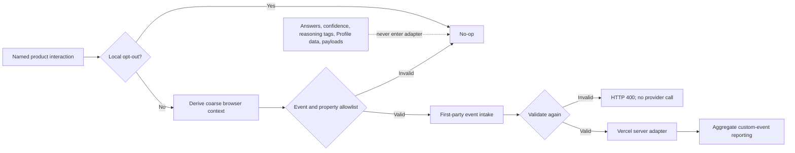

# V19 coarse product measurement

## Purpose

V19 measures acquisition, activation, learning interactions, retention proxies, and sharing with
aggregate custom-event counts. It does not create a product-measurement user ID, store a research
response, or send Current Case answers or Profile data.

The selected provider is Vercel Web Analytics. The application does not install Vercel's automatic
pageview component. Browser interactions go to the first-party `/api/analytics/event` intake, and
only the server-side provider wrapper imports `@vercel/analytics`.

## Data flow



The intake has no database write. Provider absence or failure is an accepted no-op and never blocks
the reader's product interaction. Request IP, cookie, user-agent, and referrer headers are not
forwarded by the provider wrapper. Standard hosting/runtime logs are outside this event schema and
must not be copied into app-owned analytics tables.

## Event catalog

| Event | Trigger | `caseId` |
| --- | --- | --- |
| `current_case_viewed` | A published Current Case flow finishes loading | Required |
| `current_case_started` | Reader selects “Make your first judgment” | Required |
| `current_case_completed` | A valid final judgment is saved locally | Required |
| `reading_opened` | A worldview reading disclosure is opened | Required |
| `challenge_opened` | Reader advances from readings to the assumption challenge | Required |
| `case_shared` | Native case/reading share succeeds or its link is copied | Required |
| `foundation_started` | The first Foundation answer is selected in a fresh local draft | Forbidden |
| `foundation_completed` | A complete, reviewed Foundation is generated locally | Forbidden |
| `profile_viewed` | The local Profile page mounts | Forbidden |
| `worldview_map_viewed` | The Worldview Map mounts | Forbidden |
| `newsletter_clicked` | The Substack/newsletter destination is clicked | Forbidden |

“Required” and “Forbidden” in the last column are enforced per event at runtime. Learning events do
not include the opened profile, answer, or challenge response.

## Property schema

No property other than these five can pass validation.

| Property | Values and derivation |
| --- | --- |
| `caseId` | Stable published Current Case ID; required only for case events |
| `routeCategory` | Coarse category such as `current-case`, `foundation`, `profile`, or `worldview-map`; never a path |
| `deviceClass` | `mobile`, `tablet`, `desktop`, or `unknown`, based on viewport width |
| `referrerCategory` | `direct`, `internal`, `search`, `social`, `newsletter`, or `other`; the URL is discarded in the browser |
| `returningAgeBucket` | `under-1-day`, `1-6-days`, `7-29-days`, `30-plus-days`, or `unknown` |

The return-age proxy uses only a first-seen UTC date in local storage. It is not a user ID and is
deleted when the browser opts out.

Explicitly forbidden fields include answer IDs, confidence, reasoning tags, Profile family,
dimension scores, result or share payloads, full URLs, email, free text, and IP addresses. Nested
objects and unknown event names are also rejected.

## Aggregate funnel queries

These are count-ratio funnels, not joined person-level journeys. The design intentionally provides
no stable analytics identifier, so do not describe the output as individual conversion or cohort
tracking.

Vercel's Web Analytics API exposes custom events at
`/v1/query/web-analytics/events/aggregate`. Replace the placeholder token, team, project, and dates.
The first query returns the Current Case view/start/completion rows needed for a coarse activation
funnel:

```bash
curl --get "https://api.vercel.com/v1/query/web-analytics/events/aggregate" \
  -H "Authorization: Bearer $VERCEL_TOKEN" \
  --data-urlencode "teamId=team_1234567890" \
  --data-urlencode "projectId=prj_1234567890" \
  --data-urlencode "since=2026-07-01" \
  --data-urlencode "until=2026-07-31" \
  --data-urlencode "by=eventName" \
  --data-urlencode "filter=eventName eq 'current_case_viewed' or eventName eq 'current_case_started' or eventName eq 'current_case_completed'"
```

Calculate `started / viewed` and `completed / started` from returned `count` values. Do not use the
provider's `visitors` value for cross-day identity.

Acquisition mix for Current Case views:

```bash
curl --get "https://api.vercel.com/v1/query/web-analytics/events/aggregate" \
  -H "Authorization: Bearer $VERCEL_TOKEN" \
  --data-urlencode "teamId=team_1234567890" \
  --data-urlencode "projectId=prj_1234567890" \
  --data-urlencode "since=2026-07-01" \
  --data-urlencode "until=2026-07-31" \
  --data-urlencode "by=eventData/referrerCategory" \
  --data-urlencode "filter=eventName eq 'current_case_viewed'"
```

Foundation activation and Profile payoff:

```bash
curl --get "https://api.vercel.com/v1/query/web-analytics/events/aggregate" \
  -H "Authorization: Bearer $VERCEL_TOKEN" \
  --data-urlencode "teamId=team_1234567890" \
  --data-urlencode "projectId=prj_1234567890" \
  --data-urlencode "since=2026-07-01" \
  --data-urlencode "until=2026-07-31" \
  --data-urlencode "by=eventName" \
  --data-urlencode "filter=eventName eq 'foundation_started' or eventName eq 'foundation_completed' or eventName eq 'profile_viewed'"
```

Learning interaction depth is reported as `reading_opened / current_case_started` and
`challenge_opened / current_case_started`, segmented only by `caseId` if needed. Sharing uses
`case_shared / current_case_completed`. Return proxies group events only by
`eventData/returningAgeBucket`.

## Deployment and verification

1. Enable Vercel Web Analytics custom events for the production project.
2. Confirm the plan accepts five custom properties per event. A lower provider limit requires
   removing properties; it never permits bypassing the application allowlist.
3. Deploy and trigger one event with local opt-out disabled.
4. Confirm the Vercel event data contains only keys from the property table above.
5. Enable the Privacy-page opt-out, repeat the interaction, and confirm no intake request is made.
6. Confirm no automatic pageview script is present and no research-response row is created.

Source of truth: `lib/analytics/adapter.ts`. Provider code must not be imported anywhere except
`lib/analytics/vercel.server.ts`.
